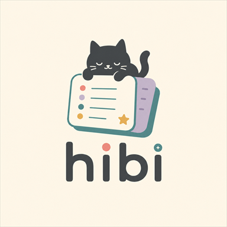
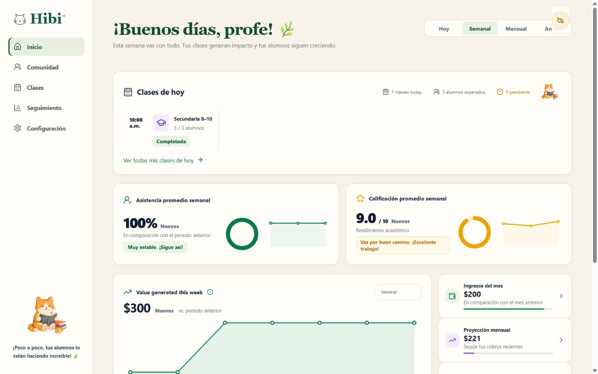
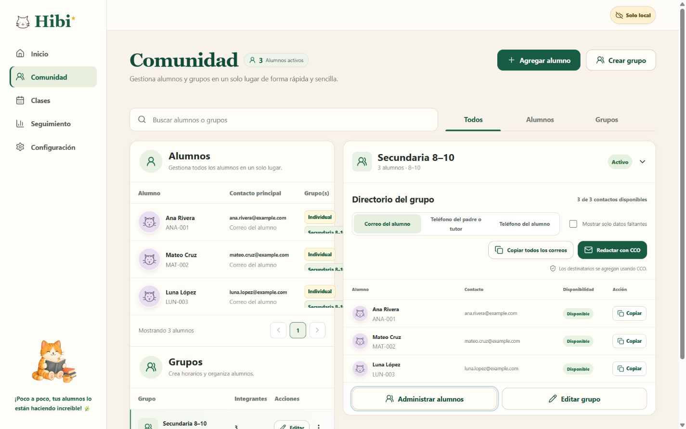
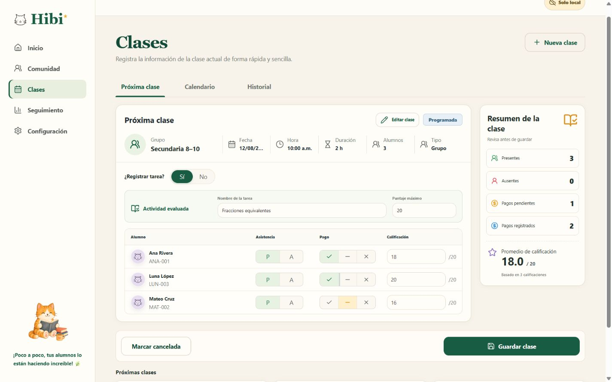
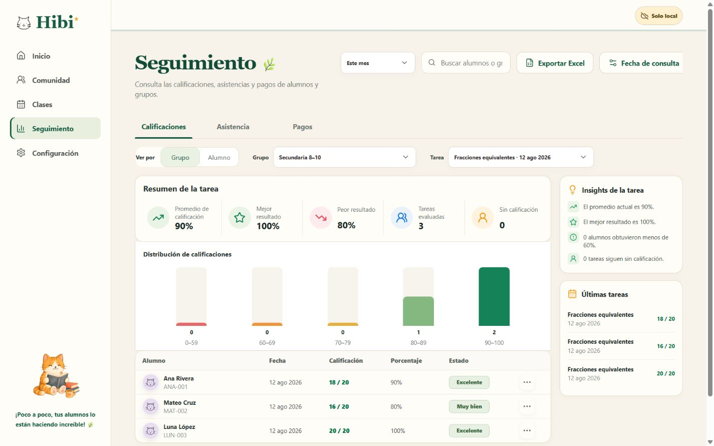
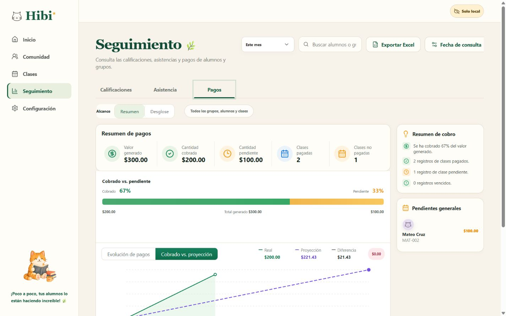
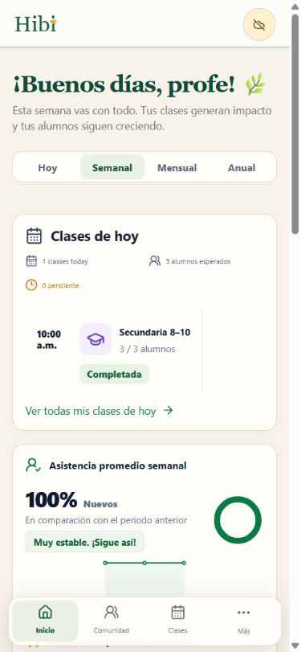

<p align="center">
  
</p>

<h1 align="center">Hibi</h1>

<p align="center">
  <strong>La gestión de tus clases, sin el ruido.</strong><br />
  Alumnos, grupos, asistencia, progreso y pagos en un solo lugar para docentes independientes.
</p>

<p align="center">
  <a href="https://usehibi.pages.dev/"><strong>Probar Hibi</strong></a>
  ·
  <a href="#capturas">Ver capturas</a>
  ·
  <a href="#funciones">Conocer las funciones</a>
</p>



## Menos administración. Más tiempo para enseñar.

Hibi es un compañero de trabajo sereno para quienes dan clases por su cuenta. Reúne la operación diaria —desde saber quién viene hoy hasta revisar qué falta por cobrar— en una interfaz clara, cálida y fácil de consultar.

- **Todo en contexto:** la información de cada alumno conecta clases, asistencia, calificaciones y saldos.
- **Seguimiento sin hojas dispersas:** registra el avance de un grupo completo desde una sola pantalla.
- **Cobros más claros:** conoce lo cobrado, lo pendiente, lo vencido y la proyección del mes.
- **Listo donde das clase:** diseño adaptable para computadora y dispositivos móviles.
- **Tus datos, bajo control:** cifrado de extremo a extremo por cuenta, sincronización en la nube y respaldos `.hibi`.

## Funciones

| Área                       | Qué puedes hacer                                                                                                                          | Beneficio                                                                         |
| -------------------------- | ----------------------------------------------------------------------------------------------------------------------------------------- | --------------------------------------------------------------------------------- |
| **Inicio**                 | Consultar clases del día, asistencia, promedio académico, valor generado, ingresos, proyección y alumnos destacados.                      | Empieza la jornada sabiendo qué ocurrió y qué requiere atención.                  |
| **Comunidad**              | Gestionar alumnos y grupos, múltiples inscripciones, horarios recurrentes y un directorio de contactos con copia o redacción por CCO.     | Mantén perfiles, organización y comunicación en un solo lugar.                    |
| **Clases**                 | Crear sesiones únicas o recurrentes, grupales o individuales; registrar asistencia, tarea, calificaciones y pago por alumno.              | Convierte cada sesión en un registro académico y financiero completo.             |
| **Calendario e historial** | Consultar próximas clases, calendario semanal y registros anteriores.                                                                     | Reduce la preparación repetitiva y encuentra cualquier sesión con rapidez.        |
| **Seguimiento**            | Analizar calificaciones, asistencia y pagos por periodo, grupo o alumno, con distribuciones, tendencias, insights y exportación a Excel.  | Detecta avances, riesgos y pendientes sin cruzar varias herramientas.             |
| **Pagos y proyecciones**   | Comparar valor generado, monto cobrado, saldo pendiente, estado por alumno y proyección de cobro.                                         | Planea el mes y evita perder clases pendientes de pago.                           |
| **Respaldo y acceso**      | Trabajar con cuenta en la nube o en modo local, importar registros, restaurar o exportar respaldos JSON, y usar Hibi en español o inglés. | Mantén continuidad entre dispositivos y conserva una copia portátil de tus datos. |

## Capturas

### Tu comunidad, organizada

Alumnos, grupos y datos de contacto están juntos, con un directorio listo para copiar correos o redactar por CCO.



### Una clase completa, en un solo flujo

Registra asistencia, pago y calificación por alumno, mientras Hibi calcula el resumen antes de guardar.



### Seguimiento que explica el avance

Consulta resultados por periodo, grupo, alumno o tarea, con distribuciones, insights y exportación a Excel.



### Cobros y proyecciones de un vistazo

Consulta valor generado, cobros, saldos pendientes y la proyección del periodo desde el mismo centro de seguimiento.



### Listo para el día a día

La navegación se adapta a pantallas pequeñas para consultar la jornada y registrar información durante la clase.

<p align="center">
  
</p>

## Cómo funciona

Hibi puede operar de dos maneras:

- **Modo nube:** Supabase autentica la cuenta, pero una passkey desbloquea por separado el contenido. El navegador cifra cada entidad antes de sincronizarla; Supabase conserva sólo ciphertext, revisiones y manifiestos de integridad.
- **Modo local:** si no se configuran credenciales de nube, Hibi puede conservar la información en el `localStorage` del navegador para uso privado u offline.

El repositorio y la compilación de producción no incluyen información real de alumnos o tutores. Las capturas de esta página usan datos ficticios de demostración.

## Ejecutar localmente

Requiere Node.js 22 y pnpm.

```powershell
pnpm install
pnpm dev
```

Sin un archivo `.env` local, el servidor de desarrollo abre en modo local. Para probar autenticación con Google y sincronización, configura Supabase siguiendo [DEPLOYMENT.md](./DEPLOYMENT.md).

## Verificar el proyecto

```powershell
pnpm quality
pnpm test:e2e
```

`pnpm quality` ejecuta lint, comprobación de formato, revisión incremental de tipos, pruebas unitarias y de componentes renderizados con umbrales de cobertura, además del build de producción. Antes de ejecutar las pruebas E2E localmente, instala Chromium una vez con `pnpm exec playwright install chromium`.

La base de datos se define en [`supabase/migrations`](./supabase/migrations). Con Docker Desktop activo, `pnpm test:db` reconstruye la base de datos aplicando todas las migraciones, revisa el esquema y ejecuta pgTAP. El procedimiento completo está documentado en [`supabase/README.md`](./supabase/README.md) y la configuración de CI y checks requeridos, en [`QUALITY.md`](./QUALITY.md).

## Migrar información existente

Antes de cambiar de la dirección local a un dominio publicado, descarga un respaldo JSON desde **Configuración → Preferencias → Respaldo y reinicio**. El almacenamiento del navegador está aislado por dominio, por lo que el sitio publicado no puede leer automáticamente los registros guardados en `127.0.0.1`.

Después de iniciar sesión en la versión publicada, restaura el archivo desde la misma pantalla. Hibi cifra localmente un JSON antiguo antes de subir cualquier cambio. Los respaldos nuevos `.hibi` son cifrados y recomendados; JSON sigue disponible como exportación avanzada legible y debe guardarse de forma privada.

La arquitectura, el modelo de amenazas, el protocolo de claves, la migración transaccional y las compuertas de rollout se documentan en [E2EE_ARCHITECTURE.md](./docs/E2EE_ARCHITECTURE.md).

La opción **Importar registros** añade información sin borrar lo existente: muestra una vista previa de registros nuevos, duplicados exactos y posibles conflictos antes de guardar. **Restaurar respaldo completo** es una operación de recuperación separada que reemplaza el espacio de trabajo únicamente después de una confirmación explícita.

## Licencia

Hibi es software de código abierto bajo la [licencia MIT](./LICENSE). Puedes usarlo, copiarlo, modificarlo, publicarlo y distribuirlo, incluso con fines comerciales, siempre que conserves el aviso de copyright y la licencia.

---

<p align="center"><strong>Hibi acompaña la enseñanza, día a día. 🌿</strong></p>
